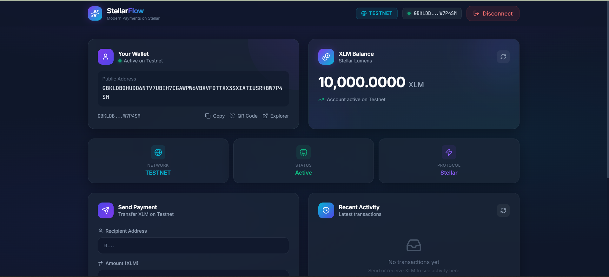
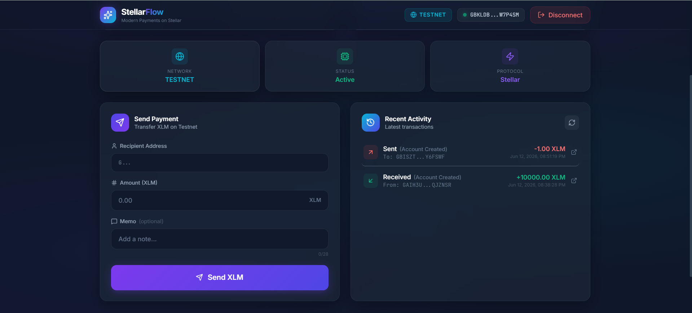
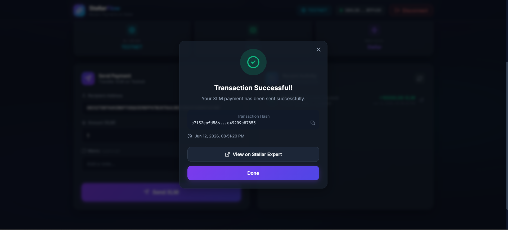
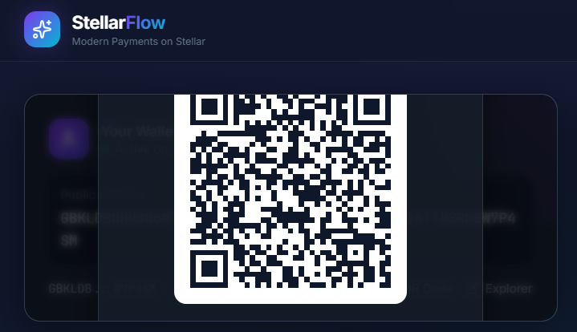

<div align="center">

# ✨ StellarFlow

### Modern Payments on Stellar Testnet

[](https://stellar.org)
[](https://react.dev)
[](https://typescriptlang.org)
[](https://vite.dev)
[](https://tailwindcss.com)

### 🚀 A Modern Stellar Testnet Payment Dashboard

Connect your Freighter wallet, view balances, send XLM payments, generate QR codes, and track transactions through a beautiful fintech-inspired dashboard built on the Stellar Testnet.

**Built for the Stellar White Belt Challenge**

[🌐 Live Demo](https://stellarflow-payment-dashboard.vercel.app/) • [⭐ GitHub Repository](https://github.com/akash-mondal-1/stellarflow-payment-dashboard)

</div>

---

# 🎯 Challenge Requirements

| Requirement                 | Status |
| --------------------------- | ------ |
| Use Stellar Testnet         | ✅      |
| Connect Freighter Wallet    | ✅      |
| Disconnect Freighter Wallet | ✅      |
| Fetch Wallet Balance        | ✅      |
| Display XLM Balance         | ✅      |
| Send XLM Transactions       | ✅      |
| Success / Failure Feedback  | ✅      |
| Display Transaction Hash    | ✅      |
| Public GitHub Repository    | ✅      |
| README Documentation        | ✅      |
| Screenshots Included        | ✅      |
| Public Deployment           | ✅      |

---

# ✨ Features

## Core Features

### 🔗 Wallet Connection

* Connect Freighter Wallet
* Disconnect Wallet
* Connection Status Indicator
* Wallet Address Display

### 💰 Balance Dashboard

* Real-time XLM Balance
* Animated Counter
* Account Status
* Network Information

### 💸 Send Payments

* Send XLM on Stellar Testnet
* Recipient Address Validation
* Amount Validation
* Optional Memo Support

### 📋 Transaction Feedback

* Success Modal
* Failure Modal
* Transaction Hash Display
* Timestamp Display
* Direct Stellar Expert Link

---

## 🌟 Bonus Features

* 📱 QR Code Generator
* 📋 Copy Wallet Address
* 📜 Transaction History
* 🔍 Stellar Expert Integration
* 🌙 Modern Dark Theme
* ✨ Smooth Animations
* 📐 Fully Responsive Layout
* 🔄 Transaction Refresh
* 🎨 Glassmorphism UI Design

---

# 🏗️ Architecture

```text
┌─────────────────────────────────────────┐
│                 Frontend                │
│ React + TypeScript + Vite + Tailwind    │
└─────────────────────────────────────────┘
                    │
                    ▼
┌─────────────────────────────────────────┐
│           Application Layer             │
│ Components • Hooks • Services • Utils   │
└─────────────────────────────────────────┘
                    │
         ┌──────────┴──────────┐
         ▼                     ▼
┌─────────────────┐   ┌─────────────────┐
│ Freighter Wallet │   │ Horizon Testnet │
│      API         │   │      API        │
└─────────────────┘   └─────────────────┘
                    │
                    ▼
┌─────────────────────────────────────────┐
│          Stellar Blockchain             │
│                Testnet                  │
└─────────────────────────────────────────┘
```

---

# 🛠️ Tech Stack

| Category      | Technology    |
| ------------- | ------------- |
| Frontend      | React 19      |
| Language      | TypeScript    |
| Build Tool    | Vite          |
| Styling       | Tailwind CSS  |
| Animations    | Framer Motion |
| Icons         | Lucide React  |
| Blockchain    | Stellar SDK   |
| Wallet        | Freighter API |
| QR Code       | qrcode.react  |
| Notifications | Sonner        |
| Deployment    | Vercel        |

---

# 📂 Project Structure

```text
src/
├── components/
│   ├── dashboard/
│   ├── layout/
│   ├── payment/
│   ├── shared/
│   ├── transactions/
│   ├── ui/
│   └── wallet/
│
├── context/
├── hooks/
├── services/
├── types/
├── utils/
│
├── App.tsx
└── main.tsx
```

---

# 🚀 Getting Started

## Prerequisites

* Node.js 18+
* Freighter Wallet Extension
* Stellar Testnet Account

---

## Installation

```bash
git clone https://github.com/YOUR_USERNAME/stellarflow-payment-dashboard.git

cd stellarflow-payment-dashboard

npm install

npm run dev
```

Application will run at:

```text
http://localhost:5173
```

---

# 💳 Funding a Testnet Wallet

1. Install Freighter Wallet
2. Switch Network to Testnet
3. Copy your wallet address
4. Open Stellar Laboratory Friendbot
5. Fund the wallet

Friendbot:

https://laboratory.stellar.org/#account-creator?network=test

You will receive 10,000 Testnet XLM.

---

# 📸 Screenshots

## Wallet Connected & Balance displayed



---

## Dashboard



---

## Successful Transaction



---

## QR Code Generator



---

# 🎓 Stellar White Belt Submission Evidence

## Wallet Connection

* Freighter Wallet successfully connected
* Disconnect functionality implemented

## Balance Display

* Live XLM balance fetched from Horizon Testnet

## Transaction Flow

* Successfully sent XLM transaction
* Transaction hash displayed
* Transaction feedback modal implemented

## Blockchain Verification

* Direct Stellar Expert transaction links included
* Real Testnet transaction completed

## Bonus Features

* QR Code Generator
* Transaction History
* Copy Address
* Responsive Design
* Animated UI

---

# 🔒 Security

* No private keys stored
* Transaction signing handled entirely by Freighter
* Testnet-only environment
* Input validation on all transaction fields
* No sensitive data stored in localStorage

---

# 🌐 Deployment

The application is deployed on Vercel.

Live URL:

```text
https://stellarflow-payment-dashboard.vercel.app/
```

Deployment Steps:

1. Push code to GitHub
2. Import repository into Vercel
3. Select Vite Framework
4. Deploy

No environment variables required.

---

# 🗺️ Future Improvements

* Multi-Asset Support
* Address Book
* CSV Export
* Soroban Smart Contract Integration
* Multi-Wallet Support
* Payment Request Links
* Push Notifications

---

# 👨‍💻 Author

### Akash Mondal

B.Tech Data Science Student
Blockchain Enthusiast • Developer • Open Source Learner

GitHub:
https://github.com/akash-mondal-1

LinkedIn:
https://linkedin.com/in/akash-mondal-1m

---

# 📄 License

This project is licensed under the MIT License.

---

<div align="center">

### ⭐ Built with React, TypeScript and Stellar

**Made with ❤️ for the Stellar Ecosystem**

</div>
